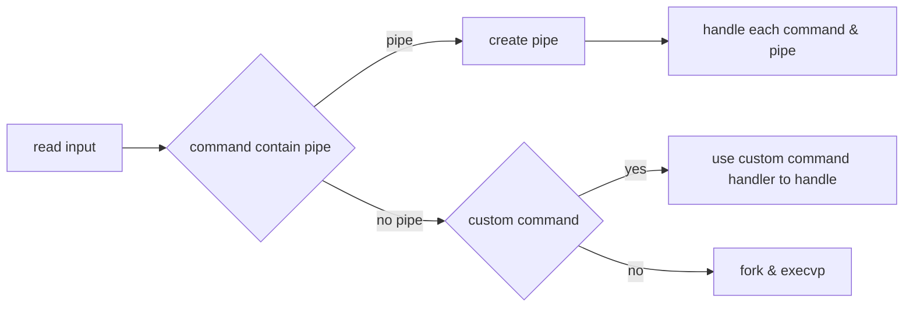

# Usage
How to compile
```
make
```

test
```
python2 test/tester.py
```

# workflow
All the codes are in the file shell.c




# Notes
difference between char s[] & char* s
```c
char s[] = "Hello world"; // s is a constant, s always = &s[0]
char *s = "Hello world"; // s is a variable, can use *s++ -> s取值後加加

while(*s)
    printf("%c", *s++);
```


malloc
```c
char* buffer = (char *)malloc(10 * sizeof(char)); //malloc return a void *  
```

dup2
```
int dup2(int oldfd, int newfd);
```

# Reference
[char s[]和char *s，兩者有什麼差異呢](https://www.cnblogs.com/oomusou/archive/2007/03/04/663234.html)

[strcpy & strncpy](https://skylinelimit.blogspot.com/2018/02/c-2.html)

[getline](https://opensource.com/article/22/5/safely-read-user-input-getline)
// As the getline reads data, it will automatically reallocate more memory for the string variable as needed.

[Why do we cast return value of malloc](https://stackoverflow.com/questions/20094394/why-do-we-cast-return-value-of-malloc)

[strsep](https://xiwan.io/archive/string-split-strtok-strtok-r-strsep.html)

[execvp](https://www.digitalocean.com/community/tutorials/execvp-function-c-plus-plus)

[chdir](https://www.geeksforgeeks.org/chdir-in-c-language-with-examples/)

[close](https://pubs.opengroup.org/onlinepubs/009604499/functions/close.html) 

[wait() hang](https://stackoverflow.com/questions/13801175/classic-c-using-pipes-in-execvp-function-stdin-and-stdout-redirection)

[Having trouble with fork(), pipe(), dup2() and exec() in C](https://stackoverflow.com/questions/916900/having-trouble-with-fork-pipe-dup2-and-exec-in-c/)

[Having trouble connecting multiple pipes together](https://stackoverflow.com/questions/63978594/having-trouble-connecting-multiple-pipes-together)

[Implementation of multiple pipes in C](https://stackoverflow.com/questions/8389033/implementation-of-multiple-pipes-in-c)

[loyola college](https://www.cs.loyola.edu/~jglenn/702/S2005/Examples/dup2.html)